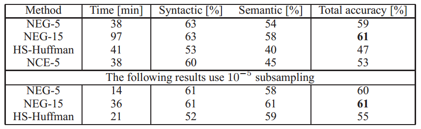
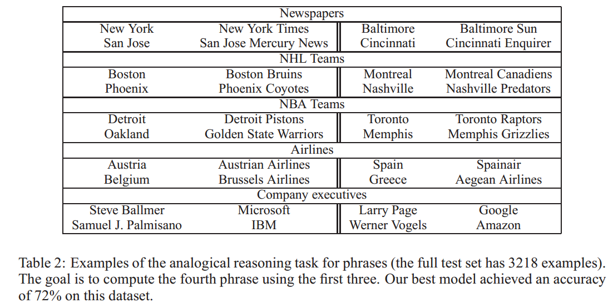

---

---

## Distributed Representations of Words and Phrases and their Compositionality 

最近引入的连续Skip-gram模型是学习高质量的分布式向量表示（distributed vector representations）的有效方法，分布式向量表示可以捕获大量精确的句法和语义关系。在本文中，我们提出了几个扩展，提高向量的质量和训练速度。通过对频繁单词(frequent words)的二次采样，我们获得了明显的加速，同时还学习到了更多的规律的单词表示(regular word representations)。我们还提出了一个分层 softmax 的简单替代方案，称为negative sampling（负采样）。

word representations的一个固有限制是：它们不关心词序，而且无法表示惯用语。例如，它不能简单的将 Canada 和 Air 的含义组合起来得到 Air Canada(加拿大航空公司) 。在这个例子的启发下，我们提出了一种在文本中查找短语的简单方法，并表明学习数百万个短语的向量表示是可能的。

### 1. Introduction

通过将相似单词分组，在向量空间中的单词分布式表示可以帮助学习算法在NLP任务中获得更好的表现。最早使用单词表示方法可以追溯到1986年（Rumelhart，Hinton和Williams）。这个想法已经被应用于统计语言模型并取得了相当大的成功。后续的工作包括在自动语音识别和机器翻译中的应用。以及大范围的NLP任务。

最近，Mikolov等人引入了Skip-gram模型，这是一个从大量非结构化文本数据中学习高质量向量表示的有效方法。与过去大部分用于学习词向量的神经网络架构不同，Skip-gram模型的训练不涉及密集矩阵的乘法计算(如下图所示)。这使得训练非常高效：一个优化过的单机实现可以在一天内训练超过1000亿单词。

使用神经网络计算的单词表示非常有趣，因为已经学得的向量明确的编码了许多语言规律和模式。令人惊讶的是，许多这种模式可以被表示为线性翻译。如：向量计算：
$$
vec("Madrid) - vec("Spain") + vec("France)
$$
的结果比其它任何词向量都接近于 vec("Paris")。

在本文中，我们提出原始Skip-gram模型的几个扩展。在训练过程中，对频繁单词进行二次采样会导致显著的加速（大约2-10倍），并且提高低频率单词的单词表示的准确性。此外，我们提出了一种用于训练Skip-gram模型的简化NCE(Noise Contrastive Estimation/噪声对比估计)。结果表明，与更复杂的分层softmax相比，它有更快的训练速度，而且高频率单词的向量表示也更好。

单词表示天生受限于惯用短语而不是独立单词的表示。例如，Boston Globe 是报纸，它不是单词 Boston 和 Globe 的含义的自然组合。因此，用向量来表示整个短语会使得Skip-gram模型更具有表现力。其它旨在通过组合单词向量（例如递归自动编码器 recursive autoencoders）来表示句子意义的技术也将受益于使用短语向量而不是单词向量。

模型从基于单词的扩展到基于短语的相对简单。首先，我们使用 data-driven的方法识别出大量的短语，然后在训练过程中将短语看作独立的tokens（标记）。为了评估短语向量的质量，我们开发了一个包含单词和短语的类比推理任务测试集。测试集中的一个典型类比对是：
$$
Montreal: Montreal Canadiens :: Toronto : Toronto Maple Leafs
$$
如果最靠近表达式：
$$
vec("Montral Canadiens") - vec("Montreal") + vec("Toronto)
$$
的表示是 vec("Toronto Maple Leafs")，则被认为回答正确。

最后，我们描述Skip-gram模型的另一个有趣属性。我们发现简单的向量加法通常可以产生有意义的结果。例如，
$$
vec("Russia") + vec("river")
$$
接近于
$$
vec("Volga River")
$$
而
$$
vec("Germany") + vec("capital")
$$
接近于
$$
vec("Berlin")
$$
这种组合表明，通过对单词向量表示使用基本的数学运算，可以获得非明显程度的语言理解。

### 2. The Skip-gram Model

Skip-gram模型的训练目标是找到可以用于预测句子或文档中的上下文单词(surrounding words)的单词表示。更正式的，给出训练单词：
$$
w_1,w_2,...,w_T
$$
Skip-gram模型的目标是最大化平均对数概率：
$$
\frac{1}{T}\sum_{t=1}^T \sum_{-c \le j \le c,j \neq 0} \mathbf {log} p(w_{t+j}|w_t)
$$
其中，$c$ 是训练上下文的尺寸(可以是中心词 $w_t$ 的函数)。较大的 $c$ 意味着更多的训练例，因此可以导致更高的准确性，同时也意味着更多的训练时间。其基本的Skip-gram公式 $p(w_{t+j}|w_t)$ 定义使用softmax函数:
$$
p(w_O|w_I) = \frac{ \mathbf {exp}({v'_{w_O}}^T v_{w_I})}{\sum_{w=1}^W \mathbf {exp} ({v'_w}^T v_{w_I})}
$$
其中，$v_w$  和 $v'_w$ 分别是 $w$ 的输入和输出向量表示，$W$ 是词汇表中的单词个数。这个公式是不切实际的，因为计算 $\nabla \mathbf {log} p(w_o|w_I)$ 的花费与 $W$ 成正比，会达到 $10^5-10^7$ 量级。

#### 2.1 Hierarchical softmax（分层的softmax）

分层(Hierarchical)的 softmax 与完全softmax的计算效率近似。它首先被Morin和Bengio在神经网络语言模型的上下文中引入。主要优点是不需要评估神经网络中的 $W$ 个输出节点以获得概率分布，仅仅需要评估 $\mathbf{log}_2W$ 个节点。

分层softmax使用二叉树表示输出层，其中二叉树包括 $W$ 个单词作为叶子节点，对于每个节点，显式的表示其子节点的相对概率。这些定义了一个可将概率分配给单词的随机游走random walk。

更准确的说，从一条合适的路径，可以从root到达每个单词 $w$。设 $n(w,j)$ 为从root单词 $w$ 的路径上的第 $j$ 个节点，$L(w)$ 为该路径的长度，则 $n(w,1)=root,n(w,L(w))=w$ 。另外，对每个内节点 $n$，设 $ch(n)$ 为 $n$ 的任意确定的子节点
$$
[[x]]=\begin{cases}1,&& x=\mathbf{true}\\-1, && \mathbf{otherwise}\end{cases}
$$
则分层softmax将按照如下公式定义 $P(w_O|w_I)$:
$$
p(w|w_I)=\prod_{j=1}^{L(w)-1}\sigma([[n(w,j+1)==ch(n(w,j))]] \cdot {v'_{n(w,j)}}^Tv_{w_I})
$$
其中，
$$
\sigma(x) = \frac{1}{1+\mathbf{exp(-x)}}
$$

可以证明的是，$\sum_{w=1}^Wp(w|w_I)=1$。这意味着计算 $\mathbf{log}p(w_O|w_I)$ 和 $\nabla \mathbf{log}p(w_O|w_I)$ 的消耗与 $L(w_O)$ 成正比。通常来说不会超过 $\mathbf{log}W$. 此外，不像Skip-gram的标准公式那样把两个表示 $v_w$ 和 $v'_w$ 分配给每个单词 $w$，在分层 softmax 公式中对每个单词 $w$ 有一个 $v_w$ 表示和二叉树的每个内部节点 $n$ 有一个 $v'_n$ 表示。

分层softmax中使用的树结构对性能有相当大的影响。Mnih和Hinton探索了构建树结构的一些方法对其训练时间和模型结果的精度的影响。在我们的工作中，我们使用一个Huffman树，因为它将短codes分配给高频词，从而加快了训练速度。之前已经观测到，根据出现频率组合单词可以很好的作为基于神经网络的语言模型的一种简单加速技术。

#### 2.2 Negative Sampling（负采样）

分层softmax的替代方案是噪声对比估计(NCE, Noise Contrastive Estimation)，由Gutmann和Hyvarinen引入，并由Mnih和Teh用于语言建模。NCE认为一个好的模型应该能够通过logistic regression 来区分数据和噪声。这类似于Collobert和Weston使用的hinge loss，他们通过对噪声上的数据进行排名来训练模型。

虽然NCE可以最大化softmax的对数概率，但是Skip-gram模型只关注学习高质量的向量表示，因此，只要向量保持其高质量，我们可以随意简化NCE。我们通过以下公式定义Negative Sampling(NEG)：
$$
\mathbf{log} \sigma({v'_{w_O}}^Tv_{w_I}) + \sum_{i=1}^k \Bbb{E}_{w_i \sim P_n(w)} [\mathbf{log} \sigma(-{v'_{w_i}}^Tv_{w_I})]
$$
使用它来代替Skip-gram目标函数中的每个 $\mathbf{log}P(w_O|w_I)$项.  如此，任务则变为利用logistic回归方法，从具有噪声分布为 $P_n(w)$ 的窗口中确定目标词 $w_O$，每个数据样本都有 $k$ 个负样本的。我们的实验表明在较小的训练数据集上，$k$ 取值在5～20比较有用；而对于较大的训练数据集 $k$ 的取值应该尽可能小，如2～5. Negative Sampling和NCE的最主要区别是NCE对于样例和噪声分布概率都是必须已知的，而Negative Sampling只使用样本。且NCE取得的是softmax的近似对数概率，这在我们的应用中不重要。

NCE和NEG将噪声分布 $P_n(w)$ 当作自由参数。我们对NCE和NEG尝试了许多任务，当然也包括语言模型，研究了一些 $P_n(w)$ 的选择，发现一元语法(unigram)分布 $U(w)$ 的 3/4 次方( $U(w)^{3/4}/Z$ )相对于一元语法分布，模型有明显提升。

#### 2.3 Subsampling of Frequent Words（高频率单词的二次采样）

在大语料中，最高频的单词出现的频次数以万计（如 in、the、a）。这样的单词提供的信息往往少于出现频次低的单词。例如，Skip-gram模型从观察 ”France“ 和 ”Paris“ 的共现频次中获得的收益，比从 ”France“ 和 ”the“ 的共现频次中获得的收益低，因为几乎每个单词都在句子中与 ”the” 连用。这个想法也可以用在相反的方向上；高频词的向量表示在大量的样本集上训练后不再显著变化。

为了计算高频词和低频词之间的不平衡性，我们使用一个简单的二次采样方法：训练集中的每个单词 $w_i$ 使用以下的概率被丢弃：
$$
P(w_i) = 1 - \sqrt{\frac{t}{f(w_i)}}
$$
其中，$f(w_i)$ 是单词 $w_i$ 的频次，$t$ 是超参数，通常是 $10^{-5}$。我们采用这个二次采样计算公式是因为它有针对性的对频率大于 $t$ 的单词进行二次采样，且能够保留单词频次的排序结果。·尽管这个公式的选择是启发式的，但是我们发现它在实际中非常有用。它能够加快训练，并明显提升低频单词的向量精度。

### 3. Empirical Result（经验结果）

本节中我们评估分层softmax(HS)、NCE、NEG、subsampling的单词训练。我们使用Mikolov提出的类比推理任务，任务由类似于
$$
Germanly : Berlin :: France : ?
$$
的类比，通过找到最接近于
$$
\mathbf{vec}(Berlin)-\mathbf{vec}(Germany)+\mathbf{vec}(France)
$$
的向量 $x$ 来解决，此处的相似度采用cosine距离计算。如果 $x$ 是 ”Paris“，则认为回答正确。这个任务可以分为两类：一是句法的类比：
$$
quick : quickly :: slow : slowly
$$
二是语义的类比：
$$
China : Beijing :: Japan : Tokyo
$$
为了训练Skip-gram模型，我们使用了一个包含各种类型新闻文章的数据集（一个包含10亿单词的Google内部数据集）。在训练数据中，我们忽略那些出现次数少于5次的低频词，得到了一个 692K 的词典. 在该数据集上训练得到的各种类型的Skip-gram在数据类比的任务中表现性能如下：

结果显示在类比推理任务中，NEG的效果显著优于分层softmax，比NCE的效果略优。对高频词的二次采样提升了训练速度并显著增加了词语表示的精度。

可以认为，Skip-gram模型得到的线性特性使得它的向量更适合于这样的线性类别推理任务，但是Mikolov的结果也表明随着训练数据量的增加，通过经典的s型递归神经网络（高度非线性的）得到的向量也能显著的提升类比推理任务的性能，这表明非线性模型也能够很好的支持单词表示的线性结构。

### 4 Learning Phrases（短语学习）

正如前面所讨论的，许多短语的含义并不是由单个单词的简单组合得到。为了学得短语的向量表示，我们首先找到共现频率较高的单词组，且这样的单词组较少出现在其他的上下文中。举例来说， 在训练数据中将 ”New York Times“ 和 "Toronto Maple Leafs"  替换为单独的tokens，而双单词组 "This is" 保持不变。

通过这种办法，我们可以在词典数量不大量增加的情况下获得许多合理的短语；理论上，我们可以使用Skip-gram模型训练所有的n-gram，但是这需要大量的内存。目前已经开发了许多技术来识别文本中的短语；然而，比较这些技术已经超出了我们的工作范围。我们决定采用一种简单的数据驱动方法来达到这个目的，短语通过下面的基于一元语法和二元语法的统计来获得：
$$
\mathbf{score}(w_i,w_j) = \frac{\mathbf{count}(w_iw_j) - \sigma}{\mathbf{count}(w_i) \times \mathbf{count}(w_j)}
$$
$\sigma$ 作为折扣系数，用于防止太多由低频单词组成的短语生成。得分高于所选阈值的bigrams被看作短语。作为尝试，我们测试了2～4的窗口通过训练数据，并逐步缩小阈值，允许多个单词组成的短语生成。我们使用新的包含短语的类别推理任务来计算短语表示的质量，下表展示了5种类别推理任务的结果。

#### 4.1 Phrase Skip-Gram Results（Skip-Gram模型的短语表示结果）

使用与前面实验相同的新闻数据集，