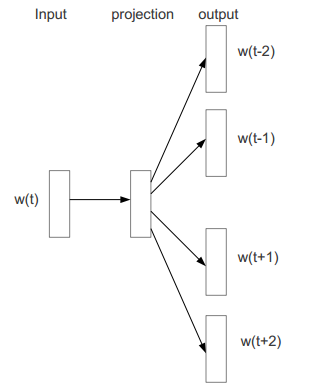

## Distributed Representations of Words and Phrases and their Compositionality 


最近引入的连续Skip-gram模型是学习高质量的分布式向量表示（distributed vector representations）的有效方法，分布式向量表示可以捕获大量精确的句法和语义关系。在本文中，我们提出了几个扩展，提高向量的质量和训练速度。通过对频繁单词(frequent words)的二次采样，我们获得了明显的加速，同时还学习到了更多的规律的单词表示(regular word representations)。我们还提出了一个分层 softmax 的简单替代方案，称为negative sampling（负采样）。

word representations的一个固有限制是：它们不关心词序，而且无法表示惯用语。例如，它不能简单的将 Canada 和 Air 的含义组合起来得到 Air Canada(加拿大航空公司) 。在这个例子的启发下，我们提出了一种在文本中查找短语的简单方法，并表明学习数百万个短语的向量表示是可能的。

### 1. Introduction

通过将相似单词分组，在向量空间中的单词分布式表示可以帮助学习算法在NLP任务中获得更好的表现。最早使用单词表示方法可以追溯到1986年（Rumelhart，Hinton和Williams）。这个想法已经被应用于统计语言模型并取得了相当大的成功。后续的工作包括在自动语音识别和机器翻译中的应用。以及大范围的NLP任务。

最近，Mikolov等人引入了Skip-gram模型，这是一个从大量非结构化文本数据中学习高质量向量表示的有效方法。与过去大部分用于学习词向量的神经网络架构不同，Skip-gram模型的训练不涉及密集矩阵的乘法计算(如下图所示)。这使得训练非常高效：一个优化过的单机实现可以在一天内训练超过1000亿单词。



使用神经网络计算的单词表示非常有趣，因为已经学得的向量明确的编码了许多语言规律和模式。令人惊讶的是，许多这种模式可以被表示为线性翻译。如：向量计算：

```math
vec("Madrid) - vec("Spain") + vec("France)
```

的结果比其它任何词向量都接近于 vec("Paris")。

在本文中，我们提出原始Skip-gram模型的几个扩展。在训练过程中，对频繁单词进行二次采样会导致显著的加速（大约2-10倍），并且提高低频率单词的单词表示的准确性。此外，我们提出了一种用于训练Skip-gram模型的简化NCE(Noise Contrastive Estimation/噪声对比估计)。结果表明，与更复杂的分层softmax相比，它有更快的训练速度，而且频率单词的向量表示也更好。

单词表示天生受限于惯用短语而不是独立单词的表示。例如，Boston Globe 是报纸，它不是单词 Boston 和 Globe 的含义的自然组合。因此，用向量来表示整个短语会使得Skip-gram模型更具有表现力。其它旨在通过组合单词向量（例如递归自动编码器 recursive autoencoders）来表示句子意义的技术也将受益于使用短语向量而不是单词向量。

模型从基于单词的扩展到基于短语的相对简单。首先，我们使用 data-driven的方法识别出大量的短语，然后在训练过程中将短语看作独立的tokens（标记）。为了评估短语向量的质量，我们开发了一个包含单词和短语的类比推理任务测试集。测试集中的一个典型类比对是：

```math
Montreal: Montreal Canadiens :: Toronto : Toronto Maple Leafs
```

如果最靠近表达式：

```math
vec("Montral Canadiens") - vec("Montreal") + vec("Toronto)
```

的表示是 vec("Toronto Maple Leafs")，则被认为回答正确。

最后，我们描述Skip-gram模型的另一个有趣属性。我们发现简单的向量加法通常可以产生有意义的结果。例如，

```math
vec("Russia") + vec("river")
```

接近于

```math
vec("Volga River")
```

而

```math
vec("Germany") + vec("capital")
```

接近于

```math
vec("Berlin")
```

这种组合表明，通过对单词向量表示使用基本的数学运算，可以获得非明显程度的语言理解。

